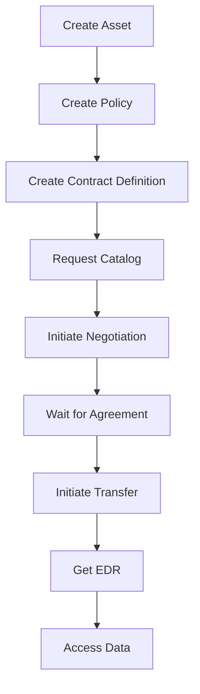

# Eclipse Dataspace Connector (EDC) - Postman Collection Setup Guide

## Overview

This Postman collection provides comprehensive REST API endpoints for testing your Eclipse Dataspace Connector deployment in a local Kubernetes environment.

## Quick Start

### 1. Import the Collection

1. Open Postman
2. Click **Import** button
3. Select `postman-collection.json`
4. The collection will appear in your workspace

### 2. Configure Environment Variables

The collection uses the following variables that you need to configure based on your k8s deployment:

| Variable | Default Value | Description |
|----------|---------------|-------------|
| `management_url` | `http://localhost:8080/management` | Management API endpoint |
| `control_url` | `http://localhost:8081/control` | Control API endpoint |
| `observability_url` | `http://localhost:8080/api` | Observability/health check endpoint |
| `auth_token` | `your-api-key-here` | API authentication key |

### 3. Kubernetes Port Forwarding

To access your EDC connector running in k8s, use port forwarding:

```bash
# Forward management API (typically port 8080 or 8081)
kubectl port-forward svc/edc-connector 8080:8080 -n your-namespace

# If you have separate control plane service
kubectl port-forward svc/edc-controlplane 8081:8081 -n your-namespace
```

### 4. Update Environment Variables for K8s

#### Option A: Using Postman Environments (Recommended)

1. Click **Environments** in Postman
2. Create a new environment (e.g., "EDC Local K8s")
3. Add the following variables:

```
management_url = http://localhost:8080/management
control_url = http://localhost:8081/control
observability_url = http://localhost:8080/api
auth_token = <your-actual-api-key>
```

4. Select this environment before running requests

#### Option B: Direct Service Access (if running from within k8s)

If running Postman tests from a pod in the cluster, use service DNS names:

```
management_url = http://edc-connector:8080/management
control_url = http://edc-controlplane:8081/control
observability_url = http://edc-connector:8080/api
```

## API Testing Workflow

### Step 1: Health Check

Start by verifying the connector is running:

1. **Observability** → **Health Check**
2. Expected response: `200 OK` with health status

### Step 2: Create Data Assets

1. **Asset Management** → **Create Asset**
2. Modify the request body:
   - Change `@id` to your asset identifier
   - Update `baseUrl` in `dataAddress` to point to your actual data source
   - For k8s internal services, use: `http://your-backend-service.namespace.svc.cluster.local:port/path`

Example for k8s backend:
```json
{
  "@id": "my-data-asset",
  "properties": {
    "name": "My Dataset",
    "description": "Dataset hosted in k8s"
  },
  "dataAddress": {
    "@type": "DataAddress",
    "type": "HttpData",
    "baseUrl": "http://data-backend.default.svc.cluster.local:8080/api/data"
  }
}
```

### Step 3: Create Policy Definitions

1. **Policy Definitions** → **Create Unrestricted Policy** (for testing)
2. Or create a restricted policy with specific constraints

### Step 4: Create Contract Definitions

1. **Contract Definitions** → **Create Contract Definition**
2. Link your asset ID with the policy IDs created in previous steps

### Step 5: Test Catalog

1. **Catalog** → **Request Catalog**
2. Update `counterPartyAddress` to another connector (if testing federation)
3. For local testing, you may need a second EDC instance

### Step 6: Initiate Contract Negotiation

1. **Contract Negotiations** → **Initiate Contract Negotiation**
2. Use the offer details from the catalog response
3. Monitor negotiation state with **Get Negotiation State**

### Step 7: Transfer Data

1. **Transfer Processes** → **Initiate Transfer**
2. Use the `contractId` (agreement ID) from the completed negotiation
3. Configure `dataDestination` based on your consumer setup
4. Monitor transfer with **Get Transfer State**

### Step 8: Retrieve Endpoint Data Reference (EDR)

1. **EDR Cache** → **Get EDR Data Address**
2. Use the transfer process ID
3. The EDR contains the actual endpoint and token to access the data

## Common Kubernetes Configurations

### Typical EDC Deployment Structure

```yaml
# Management API - Port 8080/8081
- Management endpoints (/v3/*, /v4/*)

# Protocol/DSP API - Port 8080/8282
- Dataspace protocol endpoints (/api/dsp/*)

# Public/Data Plane API - Port 8185
- Actual data transfer endpoints

# Control API - Port 9191 (internal)
- Internal control plane operations
```

### Update URLs for Multi-Port Setup

If your EDC uses different ports for different APIs:

```
management_url = http://localhost:8080/management
dsp_url = http://localhost:8282/api/dsp
public_api_url = http://localhost:8185
control_url = http://localhost:9191
```

Then update the Postman collection variables accordingly.

## Authentication

EDC supports various authentication mechanisms:

### API Key Header
```
X-Api-Key: your-api-key
```

### Bearer Token
```
Authorization: Bearer your-token
```

Check your EDC configuration (`edc.api.auth.key` or OAuth settings) and update the `auth_token` variable.

## Testing Federation Between Connectors

To test data exchange between two EDC connectors:

1. Deploy two EDC instances in k8s (provider and consumer)
2. Port-forward both:
   ```bash
   kubectl port-forward svc/edc-provider 8080:8080
   kubectl port-forward svc/edc-consumer 8090:8080
   ```
3. Create two Postman environments:
   - **Provider**: `management_url = http://localhost:8080/management`
   - **Consumer**: `management_url = http://localhost:8090/management`

### Provider Setup:
1. Create asset
2. Create policy
3. Create contract definition

### Consumer Actions:
1. Request catalog from provider
2. Initiate contract negotiation
3. Initiate transfer
4. Access data via EDR

## Troubleshooting

### Connection Refused
- Verify port-forward is active: `kubectl get pods -n namespace`
- Check connector is running: Run **Health Check** request

### 401/403 Errors
- Verify `auth_token` is correct
- Check EDC configuration for `edc.api.auth.key`
- Review authentication method (API key vs OAuth)

### 404 Errors
- Verify API paths match your EDC version
- Some endpoints may be disabled in your deployment
- Check EDC modules/extensions are loaded

### Empty Catalog
- Ensure assets, policies, and contract definitions are created
- Verify contract definition `assetsSelector` matches your asset properties
- Check policy constraints

### Transfer Process Stuck
- Verify data plane is running and accessible
- Check data source URL in asset's `dataAddress`
- Review EDC logs: `kubectl logs -f deployment/edc-connector -n namespace`

## Useful kubectl Commands

```bash
# View EDC logs
kubectl logs -f deployment/edc-connector -n your-namespace

# Check EDC configuration
kubectl get configmap edc-config -o yaml -n your-namespace

# Check EDC secrets
kubectl get secrets -n your-namespace

# Describe EDC service
kubectl describe svc edc-connector -n your-namespace

# Check pod status
kubectl get pods -l app=edc-connector -n your-namespace
```

## Additional Resources

- [Eclipse Dataspace Connector Documentation](https://eclipse-edc.github.io/docs)
- [Dataspace Protocol Specification](https://docs.internationaldataspaces.org/)
- [EDC Samples Repository](https://github.com/eclipse-edc/Samples)

## Collection Structure

### API Categories

1. **Observability** - Health checks and system status
2. **Asset Management** - Create, query, update, delete data assets
3. **Policy Definitions** - Define access and usage policies
4. **Contract Definitions** - Link assets with policies
5. **Catalog** - Discover available datasets
6. **Contract Negotiations** - Negotiate data contracts
7. **Contract Agreements** - View finalized agreements
8. **Transfer Processes** - Initiate and manage data transfers
9. **EDR Cache** - Access endpoint data references for data consumption
10. **Secrets Management** - Manage sensitive configuration values
11. **Version** - Get connector version information

## Example End-to-End Flow



## Notes

- All requests use JSON-LD format with `@context`, `@type`, and `@id` fields
- The collection uses EDC v3 APIs (stable version)
- Query endpoints use POST with `QuerySpec` for filtering and pagination
- IDs in the collection (asset-1, policy-1, etc.) are examples - replace with your actual IDs
- Transfer types depend on your data plane configuration (HttpData-PULL, HttpData-PUSH, etc.)

Happy testing! 🚀
